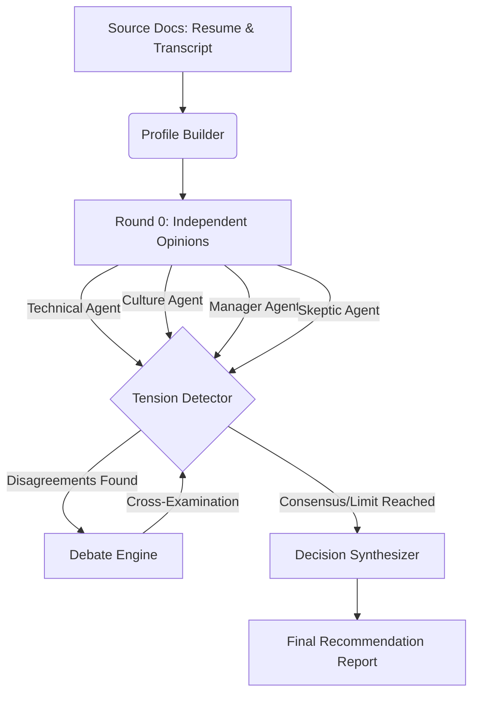

# 🤖 PromptWars: Multi-Agent Interview Panel


PromptWars is an advanced multi-agent evaluation system designed to simulate a real-world hiring panel. It uses multiple distinct AI personas to rigorously evaluate a candidate based on their resume and an interview transcript against a specific job description.

## 🎯 The Problem
Standard LLMs hallucinate evidence, succumb to sycophancy, and lack the rigorous critical thinking required for HR and recruitment evaluations. When asked to evaluate a candidate, a single AI agent often just outputs a generic "they look great!" summary.

## 🚀 The Solution
We solve this using a **cross-examining multi-agent architecture**. We instantiate 4 independent AI personas (Technical Expert, Culture Fit, Hiring Manager, and Skeptic) who review the candidate in isolation. A Debate Engine then forces these agents to cross-examine each other's opinions, defend their evidence, and update their verdicts based on pushback.



## ✨ Key Features
- **Premium UI**: A stunning Glassmorphism-styled Streamlit frontend mapping out independent opinions and debate timelines.
- **Evidence Verification**: Validates all agent quotes against the source documents using fuzzy string matching, preventing AI hallucinations natively.
- **Tension Detection & Debate**: Automatically detects contradictions between agents and forces them to debate specific claims, leading to revisions or concessions.
- **Free Execution**: Uses the `instructor` library with `Groq` to execute highly-structured JSON LLM calls entirely for free using open-source models (`openai/gpt-oss-120b`).

## 🛠️ Installation & Usage
### 1. Web Application (Recommended)
You can deploy and run the stunning GUI locally using Streamlit.
```bash
python -m venv venv
.\venv\Scripts\Activate.ps1
pip install -r requirements-gui.txt
streamlit run streamlit_app.py
```
*(Enter your Groq API key in the sidebar when the app launches).*

### 2. CLI Pipeline
Run the end-to-end pipeline headlessly via the CLI.
```bash
pip install -r requirements.txt
$env:GROQ_API_KEY="gsk_..."
python app.py --candidate ALL
```

## 📁 Project Structure
- `streamlit_app.py`: The interactive GUI.
- `src/orchestrator.py`: The pipeline controller managing rate-limits and the multi-agent execution flow.
- `src/schemas.py`: Strict Pydantic models enforcing structured LLM outputs.
- `src/debate_engine.py`: The system responsible for agent cross-examination.
- `runs/`: Output directory where all intermediate JSON artifacts and final reports are stored.
