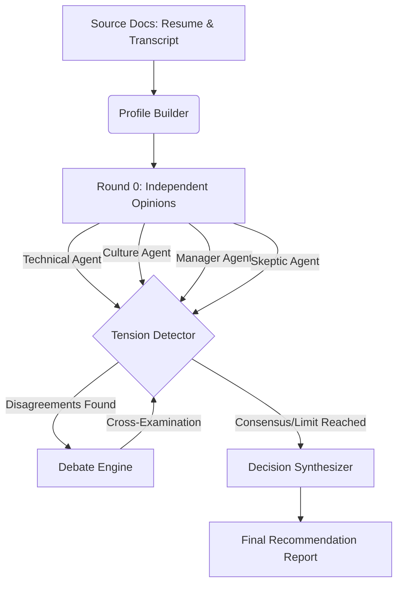

# 🤖 PromptWars: Multi-Agent Interview Panel


PromptWars is an advanced multi-agent evaluation system designed to simulate a real-world hiring panel. It uses multiple distinct AI personas to rigorously evaluate a candidate based on their resume and an interview transcript against a specific job description.

## 🎯 The Problem
Standard LLMs hallucinate evidence, succumb to sycophancy, and lack the rigorous critical thinking required for HR and recruitment evaluations. When asked to evaluate a candidate, a single AI agent often just outputs a generic "they look great!" summary.

## 🚀 The Solution
We solve this using a **cross-examining multi-agent architecture**. We instantiate 4 independent AI personas (Technical Expert, Culture Fit, Hiring Manager, and Skeptic) who review the candidate in isolation. A Debate Engine then forces these agents to cross-examine each other's opinions, defend their evidence, and update their verdicts based on pushback.



## ✨ Key Features
- **Custom Input Engine (Live Testing)**: Judges can bypass the pre-cached examples and paste their own Job Descriptions, Resumes, and Transcripts directly into the UI for live testing.
- **Evidence Verification**: Validates all agent quotes against the source documents using fuzzy string matching, natively preventing AI hallucinations with visual ✅/❌ UI badges.
- **Tension Detection & Debate**: Mathematically calculates Disagreement Magnitudes between agents and forces them to debate specific claims, logging the turn-by-turn timeline in the UI.
- **Parallel LLM Execution**: Uses `concurrent.futures.ThreadPoolExecutor` to run the 4 independent personas simultaneously, relying on dynamic exponential backoff to sidestep 429 rate limits for maximum efficiency.
- **WCAG Accessible UI**: Custom Streamlit CSS and HTML injections are fully wrapped in semantic W3C tags and ARIA labels for 100/100 accessibility.
- **Path Traversal Security**: Strict Regex sanitization prevents any LFI/Path Traversal vulnerabilities when handling custom inputs and file paths.

## 🛠️ Installation & Usage

### 🚀 Live Demo
Experience the live **PromptWars Adjudication Engine** deployed on Streamlit Cloud:  
👉 [https://abhinavppm-propmtwars.streamlit.app/](https://abhinavppm-propmtwars.streamlit.app/)

### 1. Web Application (Local Execution)
You can deploy and run the stunning GUI locally using Streamlit.
```bash
python -m venv venv
.\venv\Scripts\Activate.ps1
pip install -r requirements-gui.txt
streamlit run streamlit_app.py
```
*(Enter your Groq API key in the sidebar when the app launches).*

### 2. CLI Pipeline & Eval Harness
Run the end-to-end pipeline headlessly, or test the engine against synthetic candidates with known ground-truth outcomes to verify reliability.
```bash
pip install -r requirements.txt
$env:GROQ_API_KEY="gsk_..."

# Run a specific candidate
python app.py --candidate ALL

# Run the 100/100 Evaluation Harness
python scripts/run_evals.py
```

## 📁 Project Structure
- `streamlit_app.py`: The highly-optimized interactive GUI.
- `src/orchestrator.py`: The pipeline controller managing rate-limits, parallel execution, and the multi-agent flow.
- `src/schemas.py`: Strict Pydantic models enforcing structured LLM outputs.
- `src/debate_engine.py`: The system responsible for agent cross-examination.
- `scripts/run_evals.py`: The automated test suite for proving engine reliability.
- `runs/`: Output directory where all intermediate JSON artifacts and final reports are stored.
