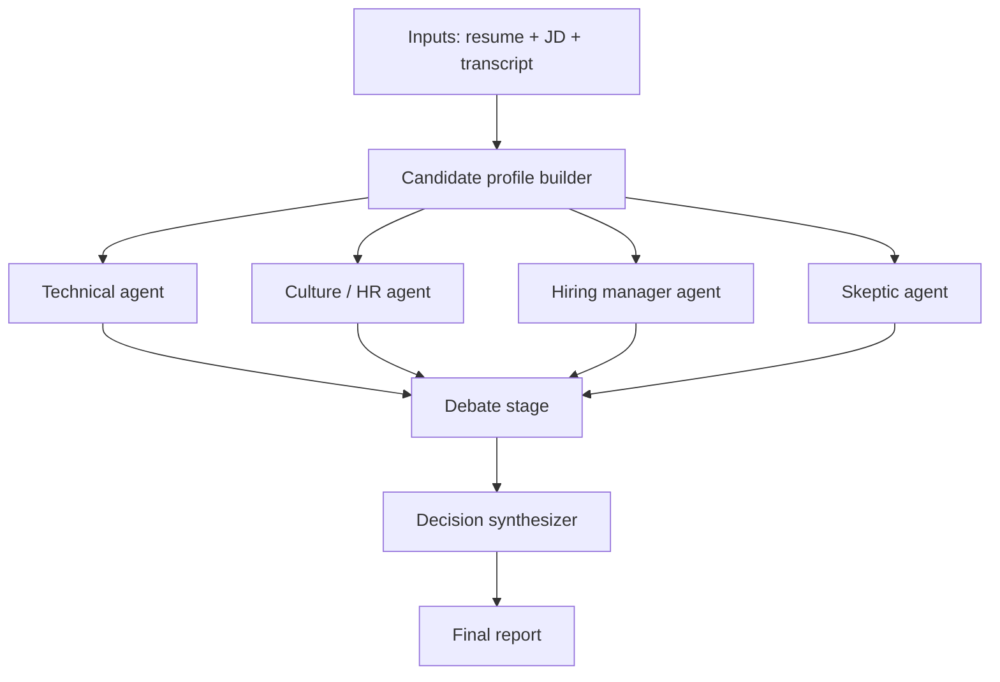

# Multi-Agent AI Interview Panel Simulator — Build Specification

**Status:** Implementation-ready
**Audience:** An LLM coding agent (e.g. Claude Code) or a human engineer implementing this from scratch
**Self-containment:** This document embeds the full text of the job description, both resumes, and both interview transcripts in Appendix A. An implementer should not need the original PDFs to build or test this system.

---

## 0. How to use this document

Read top to bottom once. Sections 4–10 are the core build — each defines a data contract, a prompt (where relevant), and the rules governing that stage. Section 12 stitches everything into one control flow. Section 17 maps every design decision back to the grading rubric so you can self-check coverage before calling this done.

Where a system prompt is given verbatim in a fenced code block, treat it as copy-paste-ready, not as a paraphrase target. Where a schema is given in Pydantic-style syntax, treat field names as exact — every other part of this spec (prompts, pseudocode, examples) refers to these exact names.

---

## 1. Problem restatement & grading rubric

**Deliverable:** A system where a team of independent AI agents reviews a resume + interview transcript against a job description, debates its findings, and reaches a hiring decision that is not a simple average — for **both** provided candidates.

**Hard requirements (from the problem statement):**
1. A candidate profile builder that extracts shared facts from resume + transcript.
2. At least 4 personas — Technical, HR/Culture, Hiring Manager, Skeptic — each giving an **independent** opinion via a **separate LLM call**, with **no agent seeing another agent's conclusions before the debate stage**.
3. Every opinion backed by a **real quote or fact**, not a bare score.
4. A **debate step** where at least one agent directly responds to another's point — agreeing, disagreeing, or revising its own opinion because of it. Side-by-side opinions do not count.
5. A **final decision step** that is not simple averaging — a reasoning step that weighs evidence and confidence.
6. A **final report** per candidate: recommendation, confidence, strengths, concerns, and any disagreement that wasn't fully resolved.
7. If there isn't enough information to judge something, the system must say so rather than fabricate a score.
8. Both candidates must be processed. Comparing/ranking them against each other is a bonus, not required.

**Grading weights (100 pts total):**

| # | Criterion | Points |
|---|---|---|
| 1 | Are the 4 personas actually different and independent? | 20 |
| 2 | Quality of the debate + how the final decision is reached | 20 |
| 3 | Can every decision be traced back to evidence? | 15 |
| 4 | How well the system/code is built | 15 |
| 5 | Does it handle unclear or missing info sensibly? | 10 |
| 6 | How easy and clear is it to use? | 10 |
| 7 | Anything creative/extra | 10 |

**Design implication:** Items 2 + 3 alone are 35 of 100 points, and the problem statement's own tip warns that most teams under-invest in the debate step. This spec treats the debate and decision stages (Sections 8–9) as the primary engineering problem, not a bolt-on after four independent chatbot calls.

---

## 2. Assumptions & scope boundaries

- LLM calls are assumed to go through an API that supports **forced structured output** (tool-use / JSON schema calling). All prompts below assume the model must return JSON matching the given schema — do not rely on prompt-only formatting instructions for anything downstream code will parse.
- "Separate LLM call" means a **fresh conversation** with no shared message history between agents. Passing all four agents' opinions into one big prompt and asking for four sections back does **not** satisfy requirement 2, even if the output looks like four opinions. The orchestrator must literally issue four independent API calls with disjoint context.
- Non-goals for the initial build: no fine-tuning, no vector database (the source documents are small enough to pass in full as context), no multi-tenant auth. These may be added later but are not required to satisfy the rubric.
- Two candidates are provided (`candidate_a`, `candidate_b`) and must both be run through the full pipeline independently before any optional comparison step.

---

## 3. Architecture overview



Note deliberately: there is **no edge between T, C, H, and S** in the independent stage. That absence is the independence requirement made structural, not just procedural — it should be reflected in code as four calls that literally cannot read each other's return values until the debate stage begins.

**Modules:**
- `profile_builder` — one LLM call per candidate, produces `CandidateProfile`
- `agents/{technical, culture, hiring_manager, skeptic}` — four independent LLM calls, each produces an `AgentOpinion`
- `evidence_verifier` — pure code (no LLM), validates every quote against source text
- `tension_detector` — pure code, computes disagreement pairs from four `AgentOpinion`s
- `debate_engine` — orchestrates targeted LLM calls between agents on detected tensions, produces `DebateTurn`s
- `decision_synthesizer` — one LLM call (the "panel chair"), produces `FinalDecision`
- `report_renderer` — pure code, deterministically merges everything into `FinalReport`

---

## 4. Data contracts

All schemas below are given in Pydantic-style syntax. Field names are binding across this entire spec.

```python
from enum import Enum
from typing import Optional
from pydantic import BaseModel

class VerificationStatus(str, Enum):
    verified = "verified"                    # formally measured
    self_reported_informal = "self_reported_informal"  # candidate admits it's informal
    unverified = "unverified"                # claimed, no verification method given

class SourceDoc(str, Enum):
    resume = "resume"
    transcript = "transcript"

class RoleEntry(BaseModel):
    title: str
    company: str
    start: str          # "YYYY-MM"
    end: Optional[str]  # None if current
    duration_months: int
    is_current: bool

class SkillClaim(BaseModel):
    skill: str
    source: SourceDoc
    quote: str
    location_hint: str   # e.g. "Skills section" or "A3"

class QuantClaim(BaseModel):
    metric: str                          # e.g. "~40% accuracy improvement"
    verification_status: VerificationStatus
    source_quote: str
    source: SourceDoc

class GapClaim(BaseModel):
    gap: str
    self_disclosed: bool                 # True if candidate volunteered it unprompted
    quote: str
    context: str                         # e.g. "Q3 technical section"

class Incident(BaseModel):
    summary: str
    root_cause_admission: bool           # did the candidate own the mistake directly?
    corrective_action: Optional[str]
    quote: str

class CandidateProfile(BaseModel):
    candidate_id: str
    name: str
    target_role: str
    identity_timeline: list[RoleEntry]
    claimed_skills: list[SkillClaim]
    quantifiable_claims: list[QuantClaim]
    self_disclosed_gaps: list[GapClaim]
    behavioral_incidents: list[Incident]

class Verdict(str, Enum):
    strong_hire = "strong_hire"
    hire = "hire"
    lean_hire = "lean_hire"
    lean_no_hire = "lean_no_hire"
    no_hire = "no_hire"
    insufficient_data = "insufficient_data"

class Confidence(str, Enum):
    low = "low"
    medium = "medium"
    high = "high"

class EvidenceItem(BaseModel):
    claim: str
    quote: str
    source: SourceDoc
    interpretation: str
    verified: Optional[bool] = None      # filled in by evidence_verifier, not by the LLM

class AgentRole(str, Enum):
    technical = "technical"
    culture = "culture"
    hiring_manager = "hiring_manager"
    skeptic = "skeptic"

class AgentOpinion(BaseModel):
    opinion_id: str
    agent_role: AgentRole
    candidate_id: str
    round: int                           # 0 = independent stage, 1+ = debate rounds
    verdict: Verdict
    confidence: Confidence
    confidence_rationale: str
    evidence: list[EvidenceItem]
    open_questions: list[str]
    insufficient_info_flags: list[str]
    revision_of: Optional[str] = None    # opinion_id this revises, if any
    revision_reason: Optional[str] = None

class TensionType(str, Enum):
    contradiction = "contradiction"           # two agents cite conflicting facts
    weighting_conflict = "weighting_conflict"  # same facts, different importance placed on them
    unverified_claim_dispute = "unverified_claim_dispute"

class Tension(BaseModel):
    tension_id: str
    agent_a: AgentRole
    agent_b: AgentRole
    claim_a: str
    claim_b: str
    tension_type: TensionType
    priority_score: float   # 0-1, higher = more load-bearing for the final decision

class ResponseType(str, Enum):
    rebut = "rebut"
    concede = "concede"
    partial_agree = "partial_agree"

class DebateTurn(BaseModel):
    turn_id: str
    round: int
    tension_id: str
    source_agent: AgentRole
    target_agent: AgentRole
    source_claim: str
    source_quote: str
    response_type: ResponseType
    response_evidence: list[EvidenceItem]
    prior_verdict: Verdict
    new_verdict: Optional[Verdict] = None       # None if unchanged
    prior_confidence: Confidence
    new_confidence: Optional[Confidence] = None

class WeightClass(str, Enum):
    decisive = "decisive"
    major = "major"
    minor = "minor"
    informational = "informational"

class WeightingRationale(BaseModel):
    dimension: str
    weight_class: WeightClass
    justification: str
    jd_requirement_ref: str     # which line of the JD this ties to

class UnresolvedDisagreement(BaseModel):
    tension_id: str
    description: str
    agents_involved: list[AgentRole]
    why_unresolved: str

class Recommendation(str, Enum):
    strong_hire = "strong_hire"
    hire = "hire"
    hire_with_reservations = "hire_with_reservations"
    no_hire = "no_hire"

class FinalDecision(BaseModel):
    candidate_id: str
    recommendation: Recommendation
    confidence: Confidence
    weighting_rationale: list[WeightingRationale]
    strengths: list[EvidenceItem]
    concerns: list[EvidenceItem]
    unresolved_disagreements: list[UnresolvedDisagreement]
```

`FinalReport` is not a separate LLM-authored schema — see Section 10, it is a deterministic render of `FinalDecision` plus the full audit trail.

---

## 5. Stage 1: Candidate profile builder

**Call type:** one LLM call per candidate. Output: `CandidateProfile`, forced to schema.

**Inputs:** raw resume text, raw transcript text, target role name.

**System prompt:**

```
You are a factual extraction engine for a hiring pipeline. You do not form opinions,
scores, or recommendations. Your only job is to read a resume and an interview
transcript and extract a structured, evidence-linked profile.

Rules:
1. Every field you populate must carry the exact quote it came from. Never
   paraphrase a quote — copy it verbatim from the source text.
2. If a claim on the resume is contradicted, clarified, or walked back in the
   transcript, capture BOTH the original claim and the transcript's version as
   separate entries, and do not silently resolve the conflict yourself — that is
   the downstream agents' job.
3. For every quantifiable claim (percentages, counts, time savings), check whether
   the transcript explains HOW it was measured. If the candidate describes it as
   informal, a guess, or "haven't verified" in the transcript, set
   verification_status to "self_reported_informal". If no measurement method is
   given anywhere, set it to "unverified". Only use "verified" if a concrete
   measurement method is described.
4. For self_disclosed_gaps, set self_disclosed=true only if the candidate raised
   the gap themselves, unprompted by a direct skeptical question pointing it out.
   If the interviewer had to confront them with it first, set self_disclosed=false
   and note that in context.
5. Do not infer motivation, honesty, or competence. That is not your job here.
6. If information needed for a field is simply absent, omit that entry rather than
   inventing one.

Output must validate against the CandidateProfile schema. Return JSON only.
```

**Why this stage matters for the rubric:** this is the single shared source of truth every agent reads. Keeping it opinion-free and quote-anchored is what makes "can every decision be traced back to evidence" (15 pts) achievable — if the profile builder editorializes, every downstream agent inherits that bias invisibly.

---

## 6. Stage 2: The four independent agents

**Hard constraint (do not violate):** each agent call is issued with its own fresh message history containing only: (a) the JD text, (b) the `CandidateProfile`, (c) the raw resume and transcript text, (d) its own persona system prompt. No agent's call may include any other agent's output. Enforce this in code by never accumulating agent outputs into a shared context object passed to the next agent call in this stage.

**Shared output schema:** `AgentOpinion`, `round=0`.

**Shared prompting rules appended to every persona prompt below:**

```
You must ground every claim in your evidence list with a verbatim quote from the
resume or transcript — copy it exactly, do not paraphrase inside the quote field.
If you cannot find a real quote for a claim, do not make the claim.

If you do not have enough information to judge a dimension of this role, add it to
insufficient_info_flags and do NOT invent a confidence level to cover the gap.
Confidence should reflect how much real evidence you have, not how the candidate
performed.

You have not seen and must not reference or assume the opinions of any other
reviewer. Form your judgment from the material given to you alone.

Output must validate against the AgentOpinion schema. Return JSON only.
```

### 6.1 Technical agent

```
You are the Technical Reviewer on a hiring panel for the role described in the job
description. Your job is to assess hands-on technical depth against what this role
actually requires — not general intelligence, not communication style.

Focus specifically on:
- Production experience with multi-agent orchestration (planner/executor/reviewer
  patterns, frameworks like LangGraph/CrewAI) versus tutorial-level or personal-
  project-level exposure. The JD states this role is "heavily oriented around
  multi-agent orchestration on day one" — weigh accordingly.
- Whether technical claims (metrics, architecture ownership, "sole" contributions)
  hold up when checked against the transcript, or get walked back under
  questioning.
- Rigor: does the candidate know HOW their own numbers were measured, or do they
  hand-wave when asked directly?
- Fit with the JD's actual stack: Python backend, MongoDB, basic React, RAG/vector
  search, OCR, model routing for cost/quality tradeoffs.

Do not penalize a candidate for honestly disclosing a gap — that is a separate
agent's concern (culture/honesty). Your job is only: how deep is the real,
demonstrated technical capability, and how well does it match this specific role's
day-one needs?
```

### 6.2 Culture / HR agent

```
You are the Culture & Communication Reviewer on a hiring panel. Your job is to
assess how this person communicates, collaborates, and handles ownership and
honesty — not their raw technical skill.

Focus specifically on:
- Ownership patterns: when something went wrong, did they take direct
  responsibility, or diffuse it? Read the full behavioral section, not just the
  headline story.
- Honesty under pressure: compare claims made proactively versus claims that only
  get corrected or softened after a skeptical follow-up question. A correction
  volunteered unprompted is a different signal than one extracted under challenge.
- Communication clarity: are answers direct and specific, or vague and deflecting?
- Team dynamics: how do they describe disagreements with teammates, and do they
  credit others' contributions accurately on their own initiative?

Read every question in the transcript for these signals, not only the section
explicitly labeled "Behavioral." A technical or ownership answer can carry a
culture signal too.
```

### 6.3 Hiring manager agent

```
You are the Hiring Manager on this panel. Your job is to make a business judgment:
given everything in the job description, is investing in this person, at this
role, worth it right now — considering ramp time, retention risk, and whether they
will actually strengthen the team on the dimensions that matter for THIS job.

Focus specifically on:
- The JD explicitly states this is not a "build it once and move on" role — it
  cares as much about sustained production ownership as initial delivery. Weigh
  tenure patterns, stated reasons for leaving past roles, and demonstrated
  follow-through after this candidate's own admitted mistakes accordingly.
- Ramp-time realism: is their stated plan for closing any skill gap concrete and
  sequenced (e.g. "read the existing code, pair on a small fix first"), or vague
  confidence ("I move fast", "wouldn't need much ramp time")?
- Whether the candidate's own answers about why they'd be worth the investment are
  substantive, or deflect the question.
- Retention risk signals: tenure length, explicitly stated reasons for job changes,
  and whether their stated reasons align with what this specific role offers.

You are allowed to weigh business risk (flight risk, ramp cost) alongside raw
capability — that is the point of your seat on this panel.
```

### 6.4 Skeptic agent

```
You are the Skeptic on this panel. Your only job is to hunt for contradictions,
exaggeration, and inconsistency between what's claimed and what's actually
supported — you are not here to make a hire/no-hire call on overall fit, you are
here to stress-test the other claims in the record.

Focus specifically on:
- Direct contradictions between the resume and the transcript (e.g. a resume
  claims sole ownership of something the transcript later attributes jointly or to
  someone else).
- Claims that only get walked back when the interviewer directly challenges them,
  versus claims the candidate corrects on their own.
- Answers that sound rehearsed or reactively shaped to whatever question was just
  asked, rather than consistent with earlier answers in the same transcript (e.g.
  check whether an answer about "long-term alignment" is consistent with an
  admission elsewhere that past moves were about pay or title).
- Metrics stated with more confidence than the candidate's own explanation of how
  they were measured supports.

For every contradiction you flag, cite BOTH sides of it with exact quotes — the
original claim and the contradicting or walked-back statement. A flag with only
one side is not a contradiction, it's a guess, and does not belong in your
evidence list.

Your verdict field should reflect how much the found issues should worry the
panel, not your view of the candidate's overall fit — that synthesis happens
later, not in your seat.
```

---

## 7. Evidence verification layer

**Not an LLM call.** Pure code, runs immediately after every `AgentOpinion` (round 0 and every debate-round revision) is produced, before it is allowed to enter the tension detector or debate engine.

```python
def verify_evidence(opinion: AgentOpinion, source_text: str) -> AgentOpinion:
    normalized_source = normalize_whitespace(source_text.lower())
    for item in opinion.evidence:
        normalized_quote = normalize_whitespace(item.quote.lower())
        if normalized_quote in normalized_source:
            item.verified = True
        elif fuzzy_ratio(normalized_quote, normalized_source) > 0.92:
            item.verified = True   # tolerate minor OCR/whitespace drift, not paraphrase
        else:
            item.verified = False
    return opinion
```

**Failure policy:**
1. If any `evidence` item fails verification, send the opinion back to the **same agent, same call type** with the specific unverified quote(s) flagged, asking it to either supply the correct verbatim quote or move that claim to `insufficient_info_flags`.
2. Retry at most 2 times per opinion.
3. If still unverified after retries, the orchestrator forcibly moves that evidence item's claim into `insufficient_info_flags` and drops it from `evidence` — never let an unverified quote reach the final report.

This is the concrete mechanism behind rubric item 3 (traceable evidence) and item 5 (handling missing info sensibly) — it is enforced by code, not by asking the model nicely in the prompt.

---

## 8. Stage 3: Tension detection & debate orchestration

This is the highest-value section of the whole build. A side-by-side listing of four opinions does not satisfy the rubric — there must be a real, targeted exchange, and at least one demonstrated revision.

### 8.1 Tension detection (pure code)

```python
def detect_tensions(opinions: list[AgentOpinion]) -> list[Tension]:
    tensions = []
    for a, b in all_pairs(opinions):
        # 1. Contradiction: overlapping subject matter, opposite verdict direction
        if verdict_polarity(a.verdict) != verdict_polarity(b.verdict) \
           and shares_subject(a.evidence, b.evidence):
            tensions.append(make_tension(a, b, TensionType.contradiction))

        # 2. Weighting conflict: same fact cited by both, different importance
        shared_fact = find_shared_cited_fact(a.evidence, b.evidence)
        if shared_fact and abs(implied_weight(a) - implied_weight(b)) > THRESHOLD:
            tensions.append(make_tension(a, b, TensionType.weighting_conflict))

        # 3. Unverified claim dispute: one agent's flagged insufficient_info
        #    directly undercuts a confident claim another agent made
        if undercuts(a.insufficient_info_flags, b.evidence):
            tensions.append(make_tension(a, b, TensionType.unverified_claim_dispute))

    return sorted(tensions, key=lambda t: -t.priority_score)[:MAX_TENSIONS_PER_ROUND]
```

`priority_score` should weight: (a) how directly the disputed claim maps to a JD requirement, (b) whether it touches integrity/honesty (these compound in an ownership-heavy role — see JD framing), and (c) confidence spread between the two agents.

**Calibration targets for this specific dataset** (use these to sanity-check the detector — see Appendix B for full grounding):
- Candidate A: expect a `contradiction` tension between **skeptic** and **technical** over the "sole architect" claim versus the transcript admission that a teammate built most of the production version.
- Candidate A: expect a `weighting_conflict` between **hiring_manager** and **technical** over how much the tenure pattern (three roles, under a year each except the first) should discount an otherwise strong technical match.
- Candidate B: expect a `weighting_conflict` between **technical** and **culture/hiring_manager** over whether the self-disclosed multi-agent gap is a hard blocker or an offset-able risk given her ownership track record.

### 8.2 Debate turn protocol

For each selected `Tension`, issue **one fresh LLM call** to the target agent — not a shared conversation, a new call containing:
- The target agent's original persona system prompt (unchanged)
- The target agent's own prior `AgentOpinion` (its own history, which is allowed)
- **Only** the specific `claim` + `quote` from the source agent that created the tension — never the source agent's full opinion

**Debate call system prompt addendum (appended to the persona prompt):**

```
Another reviewer on this panel raised a specific point that may bear on your
opinion. You are not shown their full opinion — only this one claim, so that you
evaluate it on its own merits rather than deferring to their overall verdict.

Their claim: "{source_claim}"
Their supporting quote: "{source_quote}"

Respond with exactly one of:
- "rebut": you have your own evidence that this claim doesn't change your
  assessment. Provide it with a verbatim quote.
- "concede": this claim changes your opinion. State your new verdict and/or
  confidence, and explain what specifically changed your mind.
- "partial_agree": the claim is valid but only partially affects your assessment.
  Explain what changes and what doesn't.

Do not concede just to appear collaborative, and do not rebut just to defend your
first answer. Change your mind only if the evidence actually warrants it.

Output must validate against the DebateTurn schema (response_type,
response_evidence, prior_verdict, new_verdict, prior_confidence, new_confidence).
Return JSON only.
```

Every `DebateTurn` output also passes through `verify_evidence` (Section 7) on `response_evidence`.

### 8.3 Round control

- Run tension detection again after each round using the **updated** opinions (post-revision).
- Cap at 2 rounds total.
- Stop early if a round produces zero new revisions (convergence).
- Every revision produces a new `AgentOpinion` record with `round` incremented and `revision_of` pointing to the prior `opinion_id` — never mutate the original in place. The full history must remain in the audit trail.

---

## 9. Stage 4: Decision synthesis (the "panel chair")

**Call type:** one LLM call. Not a fifth vote — a synthesis over the **post-debate** state.

**Inputs:** JD text, all final-round `AgentOpinion`s per agent, the full `DebateTurn` log, the list of `Tension`s (including any left unresolved).

**System prompt:**

```
You are the panel chair. You do not vote and you do not average scores. Your job
is to weigh the panel's evidence and reach a reasoned recommendation, the way a
thoughtful hiring manager would after sitting through the whole debate — not by
computing a mean of four numbers.

You must:
1. Read the job description and identify which of its stated requirements are
   load-bearing for this specific decision (e.g. if the JD states something is a
   "day one" responsibility, a gap there should be weighted more heavily than a
   "nice to have").
2. For each major point of evidence, assign it a weight_class (decisive, major,
   minor, informational) and justify that weight by reference to a specific line
   or theme in the job description — not just "this seems important."
3. Use the FINAL, post-debate opinions and the debate log itself, not the agents'
   original round-0 opinions. If an agent revised its view during debate, that
   revision is what happened — treat it as the agent's real position and note it.
4. For every tension that was raised but NOT resolved in the debate (agents still
   disagree after 2 rounds), you must carry it into unresolved_disagreements
   rather than silently picking a side. State why you could not or chose not to
   resolve it.
5. Every strength and concern you list must carry its own verbatim quote — you may
   pull these directly from the agents' evidence, but do not introduce new claims
   that no agent actually made and verified.
6. If the evidence genuinely doesn't support a confident call in either direction,
   your confidence should be "low" and you should say so plainly rather than
   forcing a decisive-sounding recommendation.

Output must validate against the FinalDecision schema. Return JSON only.
```

---

## 10. Stage 5: Final report generation

**Not an LLM call** — a deterministic template render of `FinalDecision` plus the audit trail, so nothing can drift from what was actually verified and decided.

```
# Candidate Report — {name} ({candidate_id})

## Recommendation: {recommendation}  (confidence: {confidence})

## Strengths
{for each item in strengths: "- {claim} — \"{quote}\" ({source})"}

## Concerns
{for each item in concerns: "- {claim} — \"{quote}\" ({source})"}

## How this decision was weighted
{for each item in weighting_rationale:
  "- **{dimension}** [{weight_class}]: {justification} (JD ref: {jd_requirement_ref})"}

## Unresolved disagreements
{for each item in unresolved_disagreements:
  "- Between {agents_involved}: {description} — not resolved because {why_unresolved}"}
{if empty: "- None — all raised tensions were resolved during debate."}

## Full audit trail
- Candidate profile: [link/ref to CandidateProfile JSON]
- Round-0 opinions (4): [links]
- Debate log ({n} turns across {rounds} rounds): [link]
- This decision: [link to FinalDecision JSON]
```

Rendering this deterministically (rather than asking an LLM to write prose freely) guarantees every line in the human-facing report is traceable to a machine-verified object, which is the strongest possible answer to rubric item 3.

---

## 11. Ambiguity & missing-information policy (cross-cutting)

This is not a separate module — it is enforced by schema shape at every stage:

- `insufficient_info_flags` is a **required** list field on `AgentOpinion` (can be empty, but the field must be present and actively considered, not omitted).
- `VerificationStatus.unverified` / `self_reported_informal` on `QuantClaim` must propagate — an agent citing a quantifiable claim as strong evidence when its `verification_status` is not `verified` should itself be treated as a candidate `tension` (an unverified_claim_dispute) rather than accepted at face value.
- The orchestrator must never let an `insufficient_info` flag silently disappear between stages — it either gets resolved with new evidence during debate, or it is carried, verbatim, into `FinalDecision.unresolved_disagreements` or surfaced as a caveat in `weighting_rationale`.
- Concretely for this dataset: Candidate A's override rate ("I'd have to check the exact number") and Candidate B's ~40% accuracy figure (explicitly informal) should both surface in the final reports as flagged/unverified — not as confident numbers, and not silently dropped either.

---

## 12. End-to-end orchestration (control flow)

```python
def run_pipeline(candidate_id: str, resume_text: str, transcript_text: str, jd_text: str) -> FinalReport:
    profile = call_profile_builder(resume_text, transcript_text, jd_text)  # Section 5

    # Stage 2 — four independent, isolated calls. No shared context object.
    opinions = {}
    for role in [AgentRole.technical, AgentRole.culture,
                 AgentRole.hiring_manager, AgentRole.skeptic]:
        raw_opinion = call_agent(role, profile, resume_text, transcript_text, jd_text)  # fresh call
        opinions[role] = verify_evidence(raw_opinion, resume_text + transcript_text)   # Section 7

    debate_log = []
    for round_num in range(1, MAX_ROUNDS + 1):
        tensions = detect_tensions(list(opinions.values()))                # Section 8.1
        if not tensions:
            break
        any_revision = False
        for tension in tensions:
            turn = run_debate_turn(tension, opinions, round_num)           # Section 8.2
            turn = verify_evidence_on_turn(turn, resume_text + transcript_text)
            debate_log.append(turn)
            if turn.new_verdict or turn.new_confidence:
                opinions[turn.target_agent] = apply_revision(opinions[turn.target_agent], turn)
                any_revision = True
        if not any_revision:
            break  # convergence

    decision = call_decision_synthesizer(                                  # Section 9
        jd_text, opinions, debate_log, tensions
    )

    return render_final_report(decision, profile, opinions, debate_log)    # Section 10


def run_all_candidates(candidates: list[dict]) -> list[FinalReport]:
    return [run_pipeline(**c) for c in candidates]   # both A and B, independently
```

**Persist everything.** Every intermediate object (`CandidateProfile`, every `AgentOpinion` including pre-revision versions, every `DebateTurn`, the final `Tension` list, and `FinalDecision`) should be written to a per-run JSON artifact (e.g. `runs/{candidate_id}_{timestamp}.json`). This artifact *is* your evidence-traceability answer for grading — a reviewer should be able to open it and follow any claim in the final report back through the exact debate turn and quote that produced it.

---

## 13. Tech stack & repository layout

**Recommended stack:** Python + an LLM API with forced structured output (tool-use/JSON schema calling), Pydantic for the schemas in Section 4, a thin FastAPI or Streamlit layer for the UI, MongoDB or plain JSON files for run persistence (JSON files are sufficient and simpler for a project this size).

```
interview-panel-simulator/
├── src/
│   ├── schemas.py                 # Section 4, verbatim
│   ├── profile_builder.py         # Section 5
│   ├── agents/
│   │   ├── prompts/
│   │   │   ├── technical.md       # Section 6.1, verbatim
│   │   │   ├── culture.md         # Section 6.2
│   │   │   ├── hiring_manager.md  # Section 6.3
│   │   │   └── skeptic.md         # Section 6.4
│   │   └── runner.py              # issues the 4 isolated calls
│   ├── evidence_verifier.py       # Section 7
│   ├── tension_detector.py        # Section 8.1
│   ├── debate_engine.py           # Section 8.2–8.3
│   ├── decision_synthesizer.py    # Section 9
│   ├── report_renderer.py         # Section 10
│   └── orchestrator.py            # Section 12
├── data/
│   ├── job_description.txt
│   ├── candidate_a_resume.txt
│   ├── candidate_a_transcript.txt
│   ├── candidate_b_resume.txt
│   └── candidate_b_transcript.txt
├── runs/                          # persisted audit-trail JSON per run
├── tests/
│   ├── test_evidence_verifier.py
│   ├── test_tension_detector.py
│   └── fixtures/
│       └── golden_candidate_a.json   # expected tensions per Appendix B
├── app.py                         # CLI or Streamlit entrypoint
└── README.md
```

Keeping persona prompts as separate `.md` files (not hardcoded Python strings) means they can be reviewed, diffed, and tuned independently — and it directly demonstrates "how well the system is built" (rubric item 4).

---

## 14. Testing strategy & golden fixtures

Because the two provided candidates have known, specific quirks (Section 8.1's calibration targets, Appendix B), use them as **golden fixtures**, not just demo data:

1. **Unit test `evidence_verifier`**: feed it a real quote (should pass), a paraphrased near-miss (should pass under fuzzy threshold), and a fabricated quote (must fail).
2. **Unit test `tension_detector`**: feed it hand-constructed opinions that mirror the skeptic-vs-technical "sole architect" conflict for Candidate A and assert it is detected as a `contradiction`.
3. **Integration test — golden run**: run the full pipeline on Candidate A and assert that the final report's `concerns` includes something referencing the "sole architect" walk-back, and that `unresolved_disagreements` or `weighting_rationale` references the tenure pattern.
4. **Integration test — Candidate B**: assert the final report explicitly surfaces the multi-agent orchestration gap as `insufficient_info` rather than a fabricated technical score, and that a strength references the production-incident ownership story with its quote.

---

## 15. Bonus / ambitious extensions

Only build these after Sections 4–12 are solid — they are explicitly worth fewer points (10 for "creative/extra") than debate quality and evidence traceability (35 combined).

- **Comparative ranking module** (explicitly named as a bonus in the brief): a fifth call that takes both candidates' `FinalDecision`s and frames the actual trade-off this dataset presents — skill-match-with-integrity-and-flight-risk versus domain-gap-with-exceptional-ownership. Don't force a single winner if the honest answer is "depends on what the team weighs more."
- **Voice debate** (explicitly named as a bonus): text-to-speech per persona, each with a distinct voice, reading out `DebateTurn` content in sequence.
- **Pre-mortem pass**: after `FinalDecision` is produced, re-invoke the skeptic agent once more against the decision itself ("here is the panel's final call — find the strongest reason it could be wrong"), and attach the result as an addendum rather than feeding it back into another revision loop.
- **Bias audit agent**: a watchdog pass that checks whether any agent's stated reasoning relied on anything outside the verified evidence set — a second, independent use of the same `evidence_verifier` machinery.

---

## 16. Build order & milestones

| # | Milestone | Acceptance criteria |
|---|---|---|
| 1 | Schemas + profile builder + evidence verifier | `CandidateProfile` produced for both candidates; verifier correctly passes/fails a hand-picked real vs. fabricated quote |
| 2 | Four independent agents | 4 isolated `AgentOpinion`s per candidate (8 total), each with ≥1 verified evidence item; confirm via logs that no agent's call included another's output |
| 3 | Tension detection + debate engine | At least the 3 calibration tensions from Section 8.1 are detected; at least one real `concede` or `partial_agree` revision is produced and logged with prior/new verdict |
| 4 | Decision synthesizer + report renderer | `FinalDecision` for both candidates references post-debate opinions, includes non-empty `weighting_rationale` tied to JD lines, and is NOT a numeric average of the four verdicts |
| 5 | UI + persistence + both candidates end-to-end | Full run artifact persisted per candidate; a human can open the report and click through to the source quote for any claim |
| 6 | Bonus features | Comparative ranking and/or voice debate, only after 1–5 are solid |

---

## 17. Rubric traceability matrix

| Rubric item | Points | Satisfied by |
|---|---|---|
| 4 personas actually different and independent | 20 | Section 6 (distinct persona prompts with non-overlapping focus areas) + Section 2's hard isolation constraint + Section 12's separate-call orchestration |
| Debate quality + final decision reasoning | 20 | Section 8 (targeted single-claim exposure, forced rebut/concede/partial_agree, logged revisions) + Section 9 (weighting rationale tied to JD, not averaging) |
| Evidence traceability | 15 | Section 7 (code-level quote verification) + Section 10 (deterministic report render) + Section 12's persisted audit trail |
| System/code quality | 15 | Section 13 (schema-first design, isolated prompt files, clean module boundaries) + Section 14 (golden-fixture tests) |
| Handling unclear/missing info | 10 | Section 11 (required `insufficient_info_flags`, `verification_status` propagation) |
| Ease of use / clarity | 10 | Section 10's report template + Section 13's UI layer |
| Creative/extra | 10 | Section 15 |

---

## Appendix A: Full source documents

### A.1 Job Description

```
Job Description: AI Engineer — Agentic Systems (Freight Operations)
Company: Cargonet AI — a freight-tech company that runs AI "agent" systems in real
production, handling things like shipment quoting, booking, tracking, document
processing, and fixing errors automatically.

About the Role
We need an engineer to help improve our existing AI agent system (think of it as
multiple AI workers — a planner, an executor, a reviewer, and specialized agents —
working together). This is not a research-only job. You will build real features
that go live for real users, mostly by directing AI coding tools (like Claude
Code) rather than writing every line by hand — and you'll be responsible for
fixing things when they break in production.

What You'll Do
- Improve the multi-agent AI system (planner, executor, reviewer, and other
  agents) that powers freight operations: quoting, booking, tracking, document
  processing, and error handling.
- Build features mainly by directing AI coding tools (like Claude Code) —
  reviewing and guiding their output, not just writing code yourself.
- Work on the Python backend (built as small services) and the React.js
  front-end, using MongoDB as the database, to build clean features and
  easy-to-use screens for operators.
- Improve how the AI is prompted, what tools/memory it has access to, and how it
  searches for relevant information (RAG / vector search); help decide which AI
  models to use for the best balance of quality and cost.
- Keep the live system running smoothly — find and fix bugs when an AI agent
  misbehaves, and improve how we test and monitor the system.
- Help connect the system to outside tools: carrier/shipping APIs, other business
  software, and document scanning (OCR) for extracting data from shipping
  documents like invoices.

What We're Looking For
- Solid Python backend skills (building APIs, working with small services).
- Some real hands-on experience with AI/LLM systems — not just tutorials. Things
  like prompt writing, RAG/vector search, and testing how well an AI system
  performs.
- Comfortable taking ownership when something breaks in production, not just when
  a demo goes well.
- Basic React.js skills for building simple front-end screens.
- Nice to have: experience with logistics/freight, document scanning (OCR), or
  connecting different business systems together.

What This Role Is NOT
This is not a "build it once and move on" role. We care as much about keeping
things working reliably over time as we do about building the first version.
```

### A.2 Resume — Candidate A (Rohan Malhotra)

```
Rohan Malhotra
Senior AI/Backend Engineer

Summary
AI engineer with 3.5 years of experience building multi-agent LLM systems and
Python backends. Led design of a production agent platform now handling thousands
of daily freight exceptions. Known for moving fast and shipping under pressure.

Experience
Senior AI Engineer — Voltrix Logistics Tech (Jan 2025 – Present, 7 months)
- Designed and built the exception-handling engine end-to-end for Voltrix's
  multi-agent freight ops platform (planner/executor/reviewer pattern), cutting
  manual exception review time by 40%.
- Owned prompt design and model routing across GPT-4 and open-weight SLMs,
  reducing inference cost by ~30%.
- Sole architect of the retry/escalation logic now running in production,
  handling 5,000+ freight exceptions/month.
- Presented the system design at a company-wide tech talk.

AI Engineer — Quickship Data Systems (Feb 2024 – Dec 2024, 11 months)
- Built a RAG pipeline over carrier rate documents using LangChain + Pinecone,
  cutting manual rate lookup time significantly.
- Improved BOL/invoice extraction accuracy through better OCR pre-processing.

Backend Developer — Nimbus Cloud Solutions (Aug 2022 – Jan 2024, 1.5 years)
- Built Python microservices for a SaaS analytics product used by 50+ enterprise
  clients.
- Led a 4-person team migrating a legacy monolith to microservices.

Skills
Python, FastAPI, LangGraph, CrewAI, MongoDB, React (basic), RAG, Vector Search
(Pinecone, FAISS), Prompt Engineering, Docker, Kubernetes

Education
B.Tech Computer Science, 2022

Certifications
- LangChain for LLM Application Development (2024)
```

### A.3 Interview Transcript — Candidate A (Rohan Malhotra)

```
Technical Section

Q1 (Interviewer): Walk me through the exception-handling engine you built at
Voltrix.
A1: It's planner-executor-reviewer. Failures come in, get classified, retried or
escalated, then double-checked. I designed the whole retry/escalation logic.

Q2: What made you choose that structure over a simpler rule-based system?
A2: Rules don't scale. Too many failure types — timeouts, bad EDI, missing BOL
fields. Agents handle that better.

Q3: How do you measure whether the reviewer agent is actually catching real
problems?
A3: We track override rate. It's low. I'd have to check the exact number though,
haven't looked recently.

Q4: What's your approach to model routing?
A4: Cost-based. Simple stuff to the SLM, harder reasoning to GPT-4. No formal
study, just tuned it as things broke.

Behavioral Section

Q5 (Interviewer): Tell me about a time you disagreed with a teammate on a
technical decision.
A5: Teammate wanted to hardcode more categories up front. I pushed for the agent
approach. We went with mine.

Q6: Who actually wrote the retry/escalation logic that's in production now?
A6: I designed it. Priya did a lot of the implementation, I reviewed her PRs. I
was the architect.

Q7 (Skeptic follow-up): Your resume says "sole architect." But it sounds like
Priya built a lot of it. Can you clarify?
A7: Fine — "sole architect" is probably too strong. I led the design, she built
most of the production version.

Ownership / Hiring Manager Section

Q8: Why should we invest in ramping you up here versus someone with more
freight-domain experience?
A8: I move fast. I've built something structurally close to this already. I don't
think I'd need much ramp time.

Q9: This role needs long-term ownership of production reliability. How do you
feel about being on-call for agent failures?
A9: Fine, I've done on-call before. Though Voltrix's user base is still small, so
I haven't seen serious incident volume yet.

Q10: You've had three roles in 3.5 years, each under a year except the first.
What's driving that?
A10: Better pay and title, mostly. Voltrix is more aligned with what I want
long-term.
```

### A.4 Resume — Candidate B (Ananya Iyer)

```
Ananya Iyer
Software Engineer (Backend → AI)

Summary
Backend engineer with steady experience maintaining internal tools, recently
moved into applied AI work. Comfortable with Python and standard web APIs; still
building depth in AI-specific tooling.

Experience
Software Engineer II — Bridgepoint Systems (Jun 2021 – Present, 4 years)
- Maintains Python/FastAPI microservices for an internal ops platform used by a
  few internal teams.
- Helped migrate part of the document ingestion pipeline to use OCR-based
  extraction for scanned forms.
- Over the last 1.5 years, started building an internal RAG-based support-ticket
  assistant: set up a retrieval pipeline (LangChain + Chroma); team estimated
  answer accuracy improved by around 40% based on informal review.
- After a production incident (see interview), introduced a pre-deploy checklist
  for prompt changes that the team adopted.

Junior Backend Developer — Bridgepoint Systems (Jul 2019 – Jun 2021, 2 years)
- Built basic REST APIs for internal tooling.
- Worked with QA and product to define API contracts.

Skills
Python, FastAPI, MongoDB, PostgreSQL, LangChain, Chroma, basic React, OCR
pipelines (Tesseract), Docker

Education
B.E. Information Technology, 2019

Note
Has not used multi-agent orchestration frameworks (LangGraph, CrewAI, AutoGen) in
production — most LLM work to date has been a single-agent RAG pipeline.
```

### A.5 Interview Transcript — Candidate B (Ananya Iyer)

```
Technical Section

Q1 (Interviewer): Tell me about the RAG pipeline you built for the support-ticket
assistant.
A1: Sure — happy to walk through it step by step. We retrieve from a Chroma
vector store built from past resolved tickets and internal docs. The top few
matches get passed to the LLM, which drafts a response for a human agent to
review before it goes out. We chunked documents by section rather than fixed
length, since that kept related context together.

Q2: Your resume mentions a ~40% accuracy improvement. How was that measured?
A2: I want to be upfront about this — it was based on internal review, not a
formal benchmark. A few of us spot-checked a sample of responses before and after
the change and it felt clearly better, but I wouldn't want to present that number
as something rigorous if it comes up again.

Q3: Have you worked with multi-agent orchestration frameworks — LangGraph,
CrewAI?
A3: Not in production. I've read through the docs for both and built a small
planner/executor toy project on my own time, but everything I've actually shipped
has been single-agent RAG. That's a real gap relative to what this role needs,
and I'd rather say that clearly than talk around it.

Q4: How would you approach ramping up on multi-agent systems specifically?
A4: I'd start by reading through your existing planner/executor/reviewer code
directly, rather than a general course, since the real failure patterns usually
aren't in the docs. Then I'd want to pair with someone on a small bug fix first,
before touching the architecture itself.

Behavioral Section

Q5 (Interviewer): Tell me about a mistake you made and how you handled it.
A5: I pushed a prompt change to the support assistant straight to production — we
didn't have a review process at the time, so nothing stopped me. It caused a
spike in bad responses for about two hours before we caught it and rolled back.

Q6: What did you do after that?
A6: A few things. First, I ran an incident retro with the team and was direct
that it was my mistake in the writeup — I didn't want to soften that. Second, I
proposed a pre-deploy checklist for prompt changes: a lightweight review step
plus a small eval set to run before anything ships. It's been part of our process
since.

Q7 (Skeptic follow-up): Was there any pushback on you owning that mistake
publicly, or did you find a way to spread the responsibility?
A7: No, I named it as mine in the retro doc. One teammate pointed out we
should've had the checklist before this happened, which is fair — but I didn't
try to shift blame for the specific incident onto the process gap.

Ownership / Hiring Manager Section

Q8: This role is heavily oriented around multi-agent orchestration on day one.
Given you haven't shipped that in production, how do you think about that gap?
A8: It's real, and I'd rather you go in with clear eyes about it than find out
later. What I'd point to instead is a pattern: I've picked up new technical areas
quickly before — OCR pipelines, then RAG — and I tend to ask for help early
instead of quietly struggling, which I think matters more for ramp time than
having already touched this exact framework.

Q9: Why should we invest in ramping you up here versus someone who already has
multi-agent experience?
A9: Honestly, I can't out-argue someone who's already done the exact work. What
I'd say is I'm a safer bet on the production-ownership side — I've been through a
real incident and changed how the team works because of it, not just shipped
something that looked good in a demo.

Q10: You've been at one company for six years. Any concern about adapting to a
fast-moving startup environment?
A10: It's a fair thing to ask about. I'd say the role itself changed a lot even
though the employer didn't — I went from junior backend work, to leading a
pipeline migration, to driving our team's move into AI. So I've had to keep
adapting, just inside one company.
```

---

## Appendix B: Calibration notes (expected findings, for self-testing)

These are not requirements to hardcode — they are a known-good oracle to sanity-check that the pipeline is actually reasoning over the evidence rather than producing generic output.

**Candidate A (Rohan Malhotra) — expected signal:**
- Strong, real production multi-agent experience — the closest direct match to the JD's day-one requirement of anyone in this pool.
- Integrity flag: resume states "sole architect," transcript (Q6–Q7) walks this back to "led the design, she built most of the production version" only after direct skeptic pressure — not volunteered.
- Rigor gaps: override rate unmeasured ("I'd have to check," A3); model routing untested ("no formal study," A4).
- Retention risk: three roles in 3.5 years, each under a year except the first; own stated reason is "better pay and title, mostly" (A10) — in tension with the JD's explicit "not build it once and move on" framing.
- Ramp-time claims are confident but non-specific ("I move fast," "wouldn't need much ramp time," A8) compared to Candidate B's concrete plan.

**Candidate B (Ananya Iyer) — expected signal:**
- Explicit, self-disclosed gap: no production multi-agent orchestration experience — this is the JD's stated day-one core requirement, and the gap is real, not merely a communication issue to be waved away.
- Consistent unprompted honesty pattern across the transcript: caveats her own 40% metric before being pushed (A2), names her own framework gap before being confronted (A3), owns a production incident without shifting blame even when a teammate raises the process gap (A7).
- Directly relevant ownership story: caused a real production incident and personally introduced the process fix that's still in use — matches the JD's emphasis on sustained ownership over "build and move on."
- Concrete, sequenced ramp-up plan (read existing code → pair on a small fix → then touch architecture, A4) rather than a general confidence claim.
- Six years at one employer with increasing scope (junior → pipeline migration lead → AI initiative lead, A10) — low flight-risk signal, directly relevant to the JD's reliability-over-time framing.

**The real tension the data presents, which a good debate stage should surface rather than flatten:** Candidate A is the stronger technical match on paper with a credibility and retention question mark; Candidate B has a real, self-acknowledged capability gap on the role's stated day-one priority, offset by the strongest ownership and honesty signal in either transcript. A system that just averages four scores will erase this tension. A system that does the debate step properly should surface it explicitly — including in `unresolved_disagreements` if the panel chair judges it genuinely close.
